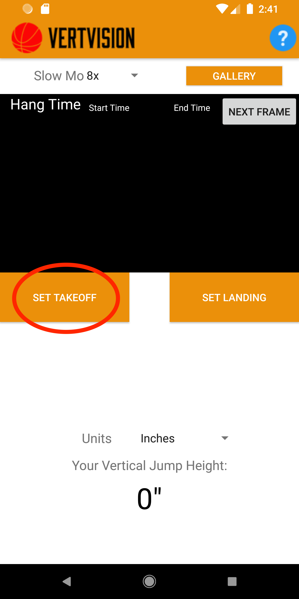
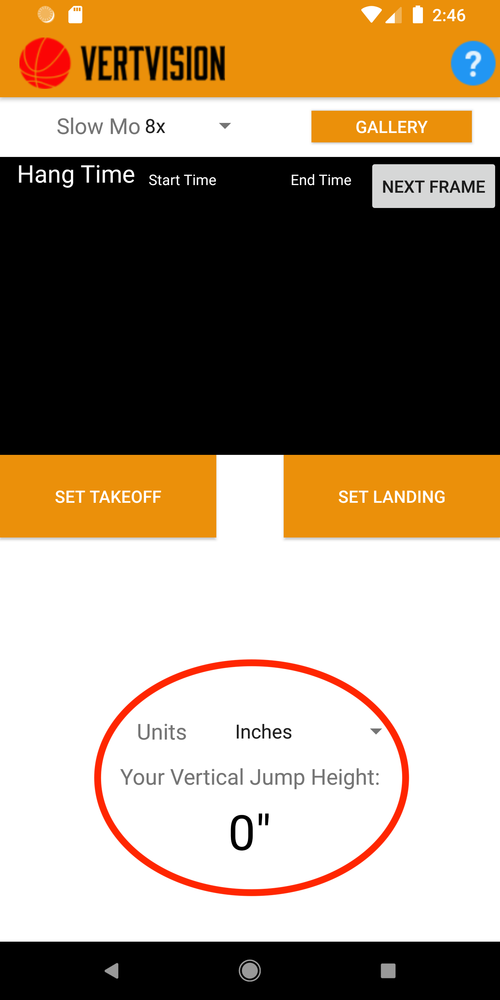

# Vertical_Jump

## Overview

🏀 An Android app to calculate your vertical jump by setting the take off time and landing time. This is the older version of the app that is currently in the google play store and the app store for the ios. 

Google Play Store:
https://play.google.com/store/apps/details?id=com.vertvision.verticaljump&hl=en_CA

App Store:
https://apps.apple.com/ca/app/vertvision/id1522416613?ign-mpt=uo%3D2

## Installation

### Download vertical_jump.apk in the repository and install into your android.

## Usage

### 1. Record Video in 8x slow motion, in widescreen mode.

### 2. Load video.

### 3. Set Take off Time

### 4. Set Landing Time

### 5. Calculate the Vertical

## Comments

Make sure when are you setting the take off time, it is when the feet just leaves the floor.

And the landing time as when the feet just touches the floor.

This is vital for the kinematic equation calculation, so that it only considers the initial time and the final time and not during the acceleration and deceleration phase.

The videos are slowed down by 8 times its normal speed, so the calculation is calibrated to videos that are 8 times slower.

## Future Additions

* Addition of multiple slow motion speed.
* OpenCv implementation.
